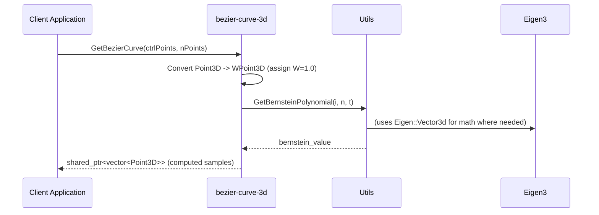

# System Architecture — bezier-curve-3d

## 1. Executive Summary & Core Purpose
bezier-curve-3d is a lightweight C++17 library for constructing Bezier curves in 2D/3D. It exposes simple, stateless APIs to compute sampled points along Bezier curves from control points. The library relies on Eigen for vector math, is built with CMake and Conan, and includes unit tests using GoogleTest.

Audience: library consumers, integrators, maintainers.

## 2. High-Level Component Architecture
- Client Application / Consumer code: calls library API.
- Library: bezier-curve-3d (headers in `include/`, impl in `src/`).
  - Data Models: Point3D, WPoint3D
  - Curve logic: BezierCurveCreator (static APIs)
  - Math helpers: Utils (Bernstein polynomials, binomial, factorial, distance)
- Third-party: Eigen3 (linear algebra), GTest (unit tests)
- Build/Packaging: CMake, Conan

Mermaid diagram (graph TD):

```mermaid
graph TD
  App[Client Application] -->|calls| Lib[bezier-curve-3d Library]
  Lib --> Models[Point3D / WPoint3D]
  Lib --> Utils[Utils (Bernstein, binomial, factorial)]
  Lib -->|links| Eigen[Eigen3 (linear algebra)]
  Build[CMake] -->|builds| Lib
  Conan[Conan] -->|provides deps| Eigen
  Tests[GTest/CTest] -->|exercises| Lib
  style Lib fill:#f9f,stroke:#333,stroke-width:1px
  style Eigen fill:#ffe,stroke:#333
  style Conan fill:#eef,stroke:#333
```

## 3. Data Flow & Sequence
Typical operation: request sampled curve from control points.

Mermaid sequenceDiagram:



Notes: t iterates from 0..1; for each t, weights are computed then normalized to produce sample points.

## 4. Key Design Patterns & Technical Trade-offs
- Static Utility class (BezierCurveCreator): simple, no state; easier use but no polymorphism or dependency injection.
- Shared ownership return type: std::shared_ptr<std::vector<Point3D>> avoids copying but adds heap/ownership complexity; returning by value could leverage RVO/move.
- Numerical approach: uses factorial/binomial and pow to compute Bernstein polynomials. Trade-offs:
  - Simpler implementation but can be numerically unstable for high-degree curves and wastes repeated work.
  - de Casteljau algorithm is recommended for numeric stability and avoiding factorials.
- Performance: repeated pow/factorial in inner loops; precompute coefficients or use iterative binomial computations to optimize.
- Error handling: throws exceptions for invalid inputs (e.g., t out of range). Suitable for exception-aware callers.
- Dependencies: Eigen adds a robust math foundation; Conan + CMake provide reproducible builds but add toolchain complexity for consumers.

## 5. Database Schema / Data Models Overview
This project contains no persistent database. Data models are in-memory C++ types:

- Point3D
  - Fields: double X, Y, Z
  - Operators: arithmetic (+, -, *, scalar ops), ostream operator

- WPoint3D (inherits Point3D)
  - Fields: double W (weight)
  - Purpose: weighted control point for rational Bezier curves

- Output: std::vector<Point3D> (returned as std::shared_ptr)

- Utils (static methods):
  - GetDistanceBetweenPoints(const Point3D&, const Point3D&)
  - GetFactorial(int)
  - GetBinomialCoefficient(int n, int i)
  - GetBernsteinPolynomial(int i, int n, double t)

## Build & Packaging Notes
- CMakeLists.txt creates `bezier-curve-3d` library target and a test executable `${LIB_NAME}_Test` (GTest).
- Build expects Conan integration (conan_toolchain and conandeps legacy generator included in CMake binary dir).
- Recommended build flow for contributors:
  1. Install conan and set up default profile.
  2. conan install . --build=missing
  3. cmake -S . -B build -DCMAKE_TOOLCHAIN_FILE=build/conan_toolchain.cmake
  4. cmake --build build

## Risks and Recommended Improvements
- Replace factorial-based Bernstein evaluation with de Casteljau or iterative binomial approach for stability and performance.
- Prefer returning std::vector<Point3D> by value (RVO) instead of shared_ptr in new API surface.
- Add CI (GitHub Actions) to run CMake, conan install, and unit tests on Linux/macOS.
- Add example usage (examples/ or demos/) and an exported CMake config for consumers who don't use Conan.

---

*File generated automatically from repository sources.*
